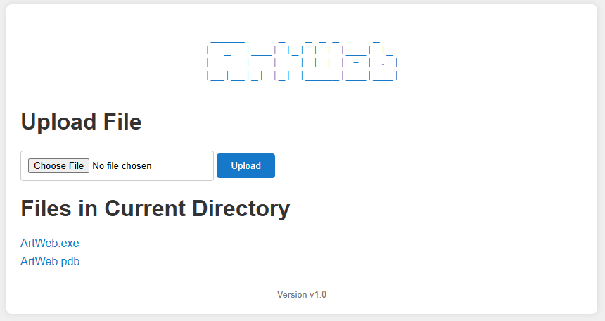

# ArtWeb

ArtWeb is a tiny web server written in C.
Based on awesome cpp-httplib project: https://github.com/yhirose/cpp-httplib



## Features

* Browse and Download files
* Upload files (with drag&drop and progress bar)
* GET and POST parameters logging
* HTTP Basic authentication support
* Multiplatform (Windows, Linux)

## Usage

```
Options:
  -h, --help             Print this help message
  --port PORT, -p PORT   Set the port (default: 80)
  --pass PASSWORD        Enable HTTP Basic authentication (username is always 'admin')
                         If not provided, no authentication is enforced.
```