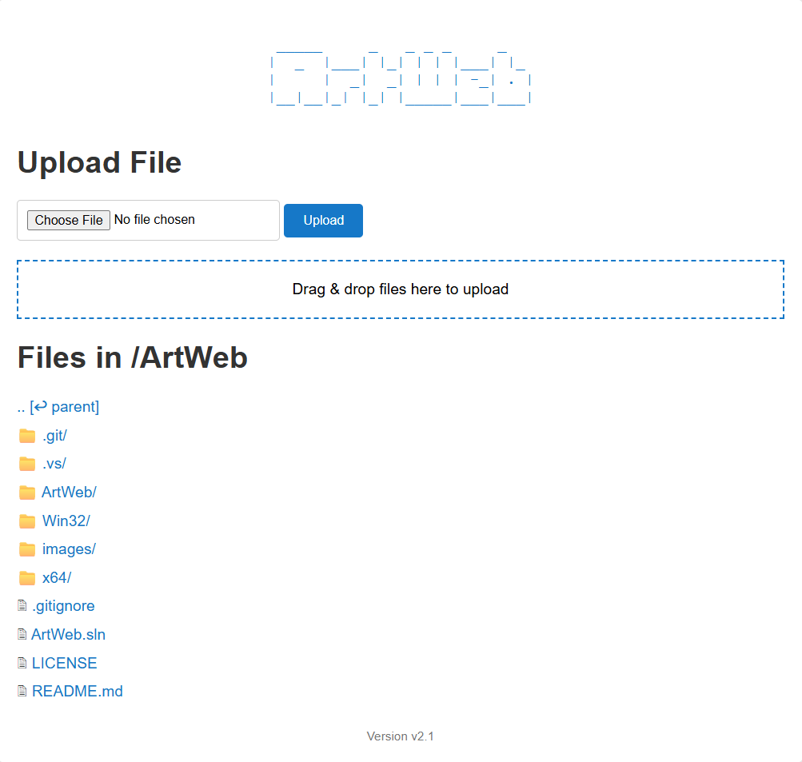

# ArtWeb: Lightweight Cross-Platform Web Server

**ArtWeb** is a lightweight, high-performance, command-line HTTP/HTTPS web server written in C++. Designed for simplicity and portability, it is compiled into a single, self-contained executable with no external runtime dependencies, making it incredibly easy to deploy and run on both Windows and Linux systems.

The server is highly versatile and operates in two distinct modes: a **Static File Server** for hosting standard websites, and a **File Browser & Uploader** for simple, web-based file management and sharing. With support for SSL/TLS, password protection, and large file transfers, ArtWeb is a powerful tool for developers, secirity researchers, and penetration testers who need a quick and reliable web server.



### Core Philosophy

*   **Simplicity:** Operated entirely from the command line with clear, intuitive flags.
*   **Portability:** A single binary file that runs on modern Windows and Linux systems.
*   **Zero Dependencies:** Through static linking, the final executable contains everything it needs to run, including the C++ runtime and OpenSSL libraries. Just copy the file and execute it.
*   **Performance:** Built on the efficient `cpp-httplib` library, offering fast, multi-threaded request handling.

### Key Features

*   **HTTP & Secure HTTPS Support:** Serve content over standard HTTP or secure HTTPS with SSL/TLS encryption.
*   **Cross-Platform:** A single codebase that compiles and runs natively on both Windows and Linux.
*   **Dual-Mode Operation:** Functions as either a standard static web server or a dynamic file management tool.
*   **HTTP Basic Authentication:** Protect your server with a simple username (`admin`) and password, ideal for securing private files or internal development sites.
*   **File uploads:** Handles file uploads up to 1 GB in size (with drag&drop and progress bar).
*   **Detailed Logging:** Prints Apache-style access logs to the console for every request, showing the client's IP address, timestamp, request method, path, POST data and status code.

---

### Modes of Operation

#### 1. Static File Server Mode (using the `--index` flag)

When you provide a directory path with the `--index` or `-i` flag, ArtWeb acts as a conventional static web server. This mode is ideal for local development, testing front-end web applications, or hosting simple websites.

*   **Web Root:** The specified directory becomes the server's root.
*   **Default Page:** Automatically serves `index.html` when a user requests a directory (e.g., `/` or `/subdir/`).
*   **MIME Type Detection:** Intelligently sets the correct `Content-Type` header based on file extensions (`.html`, `.css`, `.js`, `.png`, `.svg`, etc.), ensuring that browsers render content correctly instead of prompting for download.
*   **Use Case:** You are developing a React, Vue, or Angular application. You build your project into a `dist` folder and then run `ArtWeb.exe -i ./dist` to serve it locally for testing.

#### 2. File Browser & Uploader Mode (Default)

If the `--index` flag is not used, ArtWeb starts in its default file management mode. This provides a simple web interface for browsing the directory where the server is running, downloading files, and uploading new ones.

*   **Dynamic Directory Listing:** The web page shows a list of all files and subdirectories, with icons distinguishing between them.
*   **Easy Navigation:** Users can click on subdirectories to navigate deeper and use a "parent" link to go back up.
*   **One-Click Downloads:** Clicking on any file will initiate a direct download.
*   **Simple Uploads:**
    *   Features an easy-to-use file input and an "Upload" button.
    *   Includes a **drag-and-drop zone** for a more modern user experience.
    *   A progress bar provides real-time feedback for large uploads.
*   **Use Case:** You need to quickly get a large log file off a remote server or transfer files from your PC to a remote computer without installing dedicated file-sharing software.

---

### Usage and Command-Line Arguments

ArtWeb is configured using the following command-line flags:

| Short | Long | Description |
| :--- | :--- | :--- |
| `-h` | `--help` | Prints this help message and exits. |
| `-p` | `--port` | Sets the port to listen on. Defaults to `80` for HTTP and `443` for HTTPS. |
| `-i` | `--index` | **(Switches to Static Server Mode)**. Specifies the path to the web root directory. |
| | `--pass` | Enables HTTP Basic Authentication. Requires a password argument. The username is always `admin`. |
| `-s` | `--ssl` | Enables HTTPS mode. Requires `--cert` and `--key` to be specified. |
| `-c` | `--cert` | Specifies the path to the SSL certificate file (`.pem`). |
| `-k` | `--key` | Specifies the path to the SSL private key file (`.pem`). |

#### Examples

1.  **Run a simple file browser on port 8080:**
    ```sh
    ArtWeb.exe --port 8080
    ```

2.  **Serve a static website from the `C:\projects\my-site\build` directory:**
    ```sh
    ArtWeb.exe -i C:\projects\my-site
    ```

3.  **Run a secure, password-protected file browser over HTTPS:**
    ```sh
    ArtWeb.exe -s --cert mycert.pem --key mykey.pem --pass MySecretPassword123
    ```
    *(This will start an HTTPS server on the default port 443. Access it at `https://localhost`)*